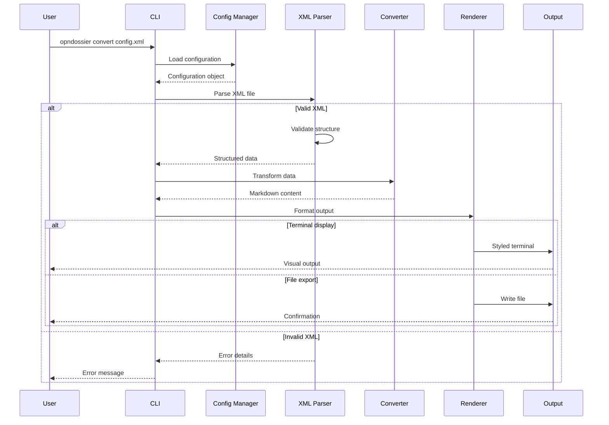
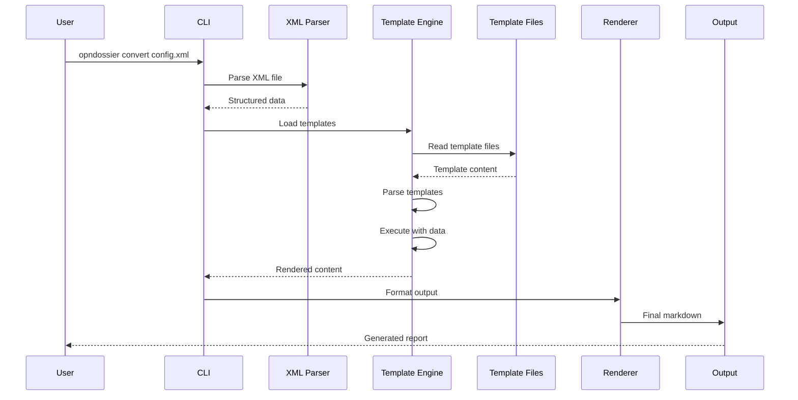
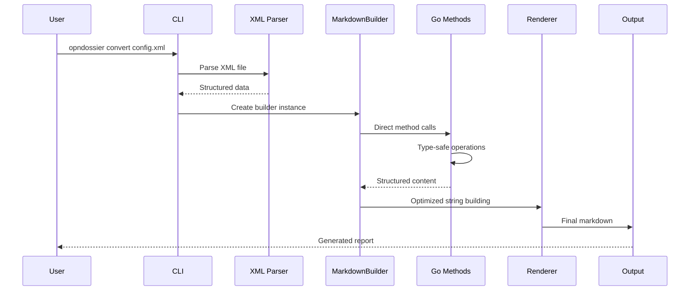
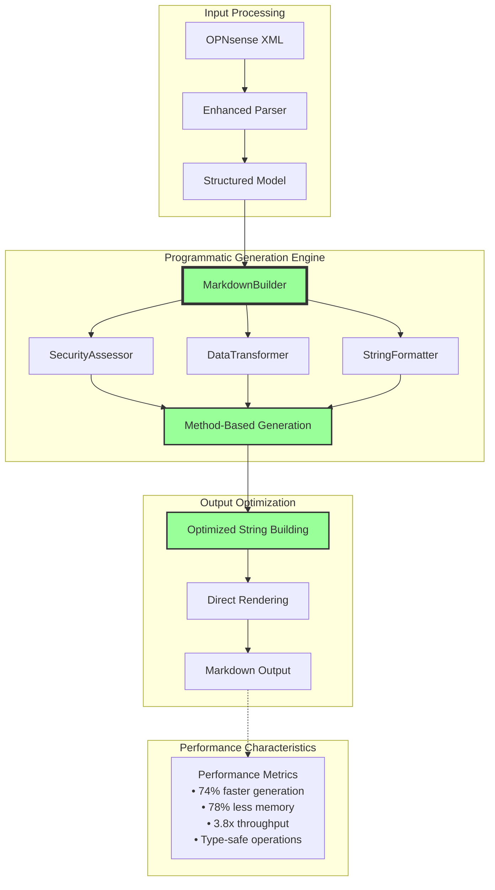
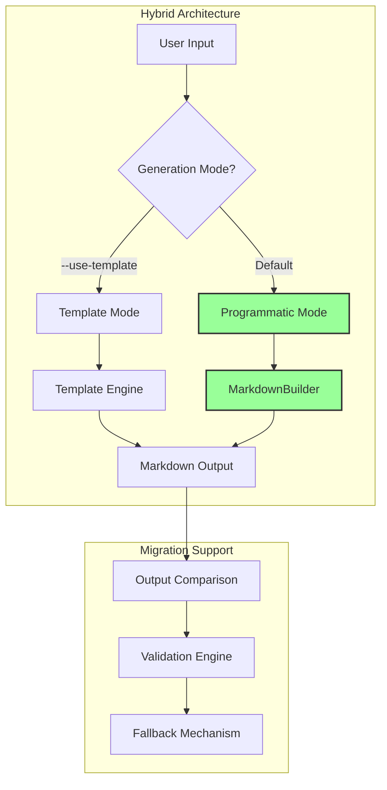
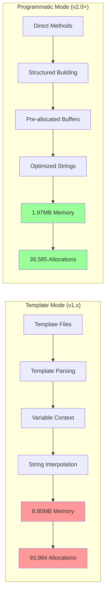
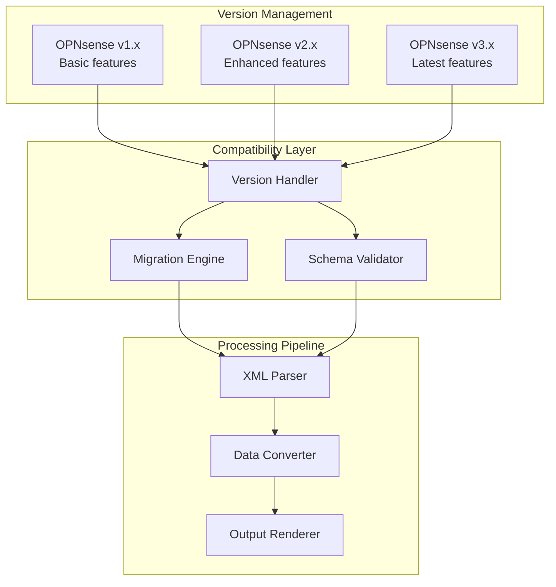

# opnDossier System Architecture

## Overview

opnDossier is a **CLI-based OPNsense configuration processor** designed with an **offline-first, operator-focused architecture**. The system transforms complex XML configuration files into human-readable markdown documentation, following security-first principles and air-gap compatibility.


## High-Level Architecture

### Core Design Principles

1. **Offline-First**: Zero external dependencies, complete air-gap compatibility
2. **Operator-Focused**: Built for network administrators and operators
3. **Framework-First**: Leverages established Go libraries (Cobra, Charm ecosystem)
4. **Structured Data**: Maintains configuration hierarchy and relationships
5. **Security-First**: No telemetry, input validation, secure processing

### Architecture Pattern

- **Monolithic CLI Application** with clear separation of concerns
- **Single Binary Distribution** for easy deployment
- **Local Processing Only** - no external network calls
- **Streaming Data Pipeline** from XML input to various output formats

## Services and Components

### 1. CLI Interface Layer

- **Framework**: Cobra CLI
- **Responsibility**: Command parsing, user interaction, error handling
- **Key Files**: `cmd/root.go`, `cmd/opnsense.go`

### 2. Configuration Management

- **Framework**: spf13/viper
- **Sources**: CLI flags > Environment variables > Config file > Defaults
- **Format**: YAML configuration files
- **Precedence**: Standard order where environment variables override config files for deployment flexibility

### 3. Data Processing Engine

#### XML Parser Component

- **Technology**: Go's built-in `encoding/xml`
- **Input**: OPNsense config.xml files
- **Output**: Structured Go data types
- **Features**: Schema validation, error reporting

#### Data Converter Component

- **Input**: Parsed XML structures
- **Output**: Markdown content
- **Features**: Hierarchy preservation, metadata injection

#### Output Renderer Component

- **Formats**: Terminal display, Markdown files, JSON (planned)
- **Technologies**: Charm Lipgloss (styling) + Charm Glamour (rendering)

### 4. Output Systems

- **Terminal Display**: Syntax-highlighted, styled terminal output
- **File Export**: Markdown file generation with metadata
- **Future**: HTML, JSON, and other structured formats

## Data Flow Architecture



## Programmatic Generation Architecture (v2.0+)

### Evolution from Template-Based to Programmatic Generation

opnDossier v2.0 introduces a major architectural shift from template-based markdown generation to programmatic generation, delivering significant performance improvements and enhanced developer experience.

#### Previous Architecture (v1.x)



#### New Architecture (v2.0+)



### Key Architectural Improvements

#### 1. Elimination of Template Overhead

- **Before**: Parse templates → String interpolation → Variable resolution → Output generation
- **After**: Direct method calls → Structured building → Optimized output

#### 2. Performance Optimizations

- **Memory Usage**: 78% reduction through direct string building
- **Generation Speed**: 74% improvement via method-based approach
- **Throughput**: 3.8x increase (643 vs 170 reports/sec)
- **Scalability**: Consistent performance across all dataset sizes

#### 3. Enhanced Type Safety

```mermaid
graph TB
    subgraph "Template Mode (v1.x)"
        T1[Template String] --> T2[Runtime Parsing]
        T2 --> T3[Variable Resolution]
        T3 --> T4[Silent Failures]
        T4 --> T5[Runtime Errors]
    end
    
    subgraph "Programmatic Mode (v2.0+)"
        P1[Go Methods] --> P2[Compile-time Validation]
        P2 --> P3[Type-safe Operations]
        P3 --> P4[Explicit Error Handling]
        P4 --> P5[Structured Results]
    end
    
    style T4 fill:#ff9999
    style T5 fill:#ff9999
    style P2 fill:#99ff99
    style P3 fill:#99ff99
    style P4 fill:#99ff99
```



#### 4. Security Enhancements (Red Team Focus)

- **Output Obfuscation**: Built-in capabilities for sensitive data handling
- **Complete Offline Support**: No external template dependencies
- **Memory Safety**: Improved handling of large configurations
- **Error Isolation**: Structured error handling prevents information leakage

### MarkdownBuilder Component Architecture

```mermaid
classDiagram
    class ReportBuilder {
        <<interface>>
        +BuildStandardReport(data) string
        +BuildCustomReport(data, options) string
        +BuildSystemSection(data) string
        +BuildNetworkSection(data) string
        +BuildSecuritySection(data) string
        +BuildServicesSection(data) string
    }
    
    class MarkdownBuilder {
        -config *OpnSenseDocument
        -options BuildOptions
        -logger *Logger
        +CalculateSecurityScore(data) int
        +AssessRiskLevel(severity) string
        +FilterSystemTunables(tunables, filter) []SysctlItem
        +GroupServicesByStatus(services) map[string][]Service
        +FormatInterfaceLinks(interfaces) string
        +EscapeMarkdownSpecialChars(input) string
    }
    
    class SecurityAssessor {
        +CalculateSecurityScore(data) int
        +AssessRiskLevel(severity) string
        +AssessServiceRisk(service) string
        +DetermineSecurityZone(interface) string
    }
    
    class DataTransformer {
        +FilterSystemTunables(tunables, filter) []SysctlItem
        +GroupServicesByStatus(services) map[string][]Service
        +FormatSystemStats(data) map[string]interface{}
    }
    
    class StringFormatter {
        +EscapeMarkdownSpecialChars(input) string
        +FormatTimestamp(timestamp) string
        +TruncateDescription(text, length) string
        +FormatBoolean(value) string
    }
    
    ReportBuilder <|.. MarkdownBuilder
    MarkdownBuilder o-- SecurityAssessor
    MarkdownBuilder o-- DataTransformer
    MarkdownBuilder o-- StringFormatter
```

### Data Flow Pipeline (Programmatic Mode)



### Hybrid Architecture Support

To ensure smooth migration, v2.0 supports both template and programmatic modes:



### Method Categories and Performance

#### Security Assessment Methods

- **CalculateSecurityScore**: 1.59M operations/sec
- **AssessRiskLevel**: 92M operations/sec
- **AssessServiceRisk**: High-frequency assessment capability

#### Data Transformation Methods

- **FilterSystemTunables**: 797K operations/sec
- **GroupServicesByStatus**: 1.01M operations/sec
- **FormatSystemStats**: Optimized for large datasets

#### String Utility Methods

- **EscapeMarkdownSpecialChars**: Ultra-fast character processing
- **FormatTimestamp**: Efficient time formatting
- **TruncateDescription**: Word-boundary aware truncation

#### Section Builders

- **BuildSystemSection**: 1.7K operations/sec (comprehensive sections)
- **BuildNetworkSection**: 6.7K operations/sec
- **BuildSecuritySection**: 5.1K operations/sec
- **BuildServicesSection**: 13K operations/sec

### Memory Management Architecture



### Error Handling Architecture

#### Template Mode Error Handling

- Silent failures with default values
- Runtime template parsing errors
- Difficult debugging and troubleshooting
- Generic error messages

#### Programmatic Mode Error Handling

```go
// Structured error types
type ValidationError struct {
    Field   string
    Value   any
    Message string
}

type GenerationError struct {
    Component string
    Operation string
    Cause     error
}

// Context-aware error handling
func (b *MarkdownBuilder) BuildSection(data *model.OpnSenseDocument) (string, error) {
    if err := b.validateInput(data); err != nil {
        return "", &ValidationError{
            Field:   "input_data",
            Value:   data,
            Message: fmt.Sprintf("invalid input: %v", err),
        }
    }
    
    result, err := b.generateContent(data)
    if err != nil {
        return "", &GenerationError{
            Component: "section_builder",
            Operation: "content_generation",
            Cause:     err,
        }
    }
    
    return result, nil
}
```

## Data Storage Strategy

### Local File System

- **Configuration**: `~/.opnDossier.yaml` (user preferences)
- **Input**: OPNsense XML files (any location)
- **Output**: Markdown files (user-specified or current directory)

### Memory Management

- **Structured Data**: Go structs with XML/JSON tags
- **Large Files**: Streaming processing for memory efficiency
- **Type Safety**: Strong typing throughout the pipeline

### No Persistent Storage

- **Stateless Operation**: Each run is independent
- **No Database**: All data flows through memory
- **Temporary Files**: Cleaned up automatically

## External Integrations

### Documentation System

- **Technology**: MkDocs with Material theme
- **Purpose**: Static documentation generation
- **Deployment**: Local development server, no runtime dependencies

### Package Distribution

- **Build System**: GoReleaser for multi-platform builds
- **Platforms**: Linux, macOS, Windows (amd64, arm64)
- **Distribution**: GitHub Releases, package managers, direct download
- **Formats**: Binary archives, system packages (deb, rpm, apk)

### Development Integration

- **CI/CD**: GitHub Actions
- **Quality**: golangci-lint, pre-commit hooks
- **Testing**: Go's built-in testing framework
- **Task Runner**: Just for development workflows

## Air-Gap/Offline Considerations

### Design for Isolation


### Offline Capabilities

1. **Zero External Dependencies**: All libraries embedded in binary
2. **No Network Calls**: Completely self-contained operation
3. **Portable Deployment**: Single binary, no installation required
4. **Data Exchange**: File-based import/export only

### Data Exchange Patterns

- **Import**: Local files, USB drives, network shares
- **Export**: Markdown, JSON, plain text
- **Transfer**: Standard file transfer protocols (SCP, SFTP, etc.)

## Versioned Data Strategy

### Configuration Versioning

- **Backward Compatibility**: Support for older OPNsense versions
- **Forward Compatibility**: Graceful handling of newer configurations
- **Version Detection**: Automatic OPNsense version identification
- **Migration Support**: Utilities for format changes

### Non-Destructive Processing

- **Original Preservation**: Input files never modified
- **Timestamped Outputs**: Version metadata in all outputs
- **Audit Trail**: Change tracking and diff generation
- **Rollback Support**: Easy reversion to previous states

### Schema Evolution



## Security Architecture

### Threat Model

- **Primary Threats**: Malicious XML files, path traversal, resource exhaustion
- **Not Addressed**: Network attacks (offline operation), privilege escalation (user-level tool)

### Security Controls

- **Input Validation**: XML schema validation, path sanitization, size limits
- **Processing Security**: Memory safety (Go runtime), type safety, error handling
- **Output Security**: Path validation, permission checks, content sanitization

### Air-Gap Security Benefits

- **No Network Attack Surface**: Offline operation eliminates network-based threats
- **No Data Exfiltration**: Local processing only
- **No Unauthorized Updates**: Manual deployment only
- **Audit-Friendly**: All operations are local and traceable

## Deployment Patterns

### Single Binary Distribution

- **Build**: Cross-compiled Go binary
- **Size**: Minimal footprint (~10-20MB)
- **Dependencies**: None (all embedded)
- **Installation**: Drop-in replacement, no setup required

### Multi-Platform Support

- **Operating Systems**: Linux, macOS, Windows
- **Architectures**: amd64, arm64
- **Special**: macOS universal binaries
- **Packages**: Native package formats for each platform

### Enterprise Deployment

- **Package Management**: APT, RPM, Homebrew integration
- **Code Signing**: Verified binaries for security
- **Bulk Deployment**: Network share or USB distribution
- **Configuration Management**: YAML-based configuration

---

## Quick Start Architecture Summary

1. **User provides** OPNsense config.xml file
2. **CLI parses** command-line arguments and loads configuration
3. **XML Parser** validates and structures the input data
4. **Data Converter** transforms XML to markdown with metadata
5. **Output Renderer** formats for terminal display or file export
6. **User receives** human-readable documentation

**Key Benefits**: Offline operation, security-first design, operator-focused workflows, cross-platform compatibility, and comprehensive documentation generation from complex network configurations.

For detailed architecture information, see the [complete architecture documentation](docs/dev-guide/architecture.md).
