# opnDossier - OPNsense Configuration Processor

[](https://golang.org)
[](LICENSE)
[](https://codecov.io/gh/EvilBit-Labs/opnDossier)
[](https://github.com/EvilBit-Labs/opnDossier/blob/main/docs/index.md)
[](https://github.com/EvilBit-Labs/opnDossier/actions/workflows/ci-check.yml)
[](https://github.com/EvilBit-Labs/opnDossier/actions/workflows/codeql.yml)

[](https://wakatime.com/badge/user/2d2fbc27-e3f7-4ec1-b2a7-935e48bad498/project/018dae18-42c0-4e3e-8330-14d39f574bd5)
[](https://app.fossa.com/projects/git%2Bgithub.com%2FEvilBit-Labs%2FopnDossier?ref=badge_shield)

## Overview

A command-line tool designed specifically for network operators and administrators working with OPNsense firewalls. This tool transforms complex XML configuration files into clear, human-readable markdown documentation, making it easier to understand, document, and audit your network configurations.

**Built for operators, by operators** - with a focus on offline operation, structured data, and intuitive workflows.

### v1.0 Release Features

opnDossier v1.0 provides a robust foundation for OPNsense configuration processing:

- **Core XML Processing**: Parse and validate OPNsense config.xml files
- **Multi-Format Export**: Convert to markdown, JSON, or YAML formats
- **Terminal Display**: Rich terminal output with syntax highlighting and themes
- **File Export**: Save processed configurations with overwrite protection
- **Offline Operation**: Complete offline functionality for airgapped environments
- **Cross-Platform**: Native binaries for Linux, macOS, and Windows
- **Comprehensive Error Handling**: Detailed validation and error reporting

## Features

- **Parse OPNsense XML configurations** - Process complex configuration files with ease
- **Configuration Validation** - Comprehensive validation with detailed error reporting
- **Convert to Markdown** - Generate human-readable documentation from XML configs
- **Export to Files** - Save processed configurations as markdown, JSON, or YAML files
- **Offline Operation** - Works completely offline, perfect for airgapped environments
- **Security-First** - No external dependencies, no telemetry, secure by design
- **Fast & Lightweight** - Built with Go for performance and reliability
- **Streaming Processing** - Memory-efficient handling of large configuration files
- **Advanced Analysis** - Dead rule detection, unused interface analysis, and security scanning
- **Compliance Checking** - Built-in compliance validation with detailed reporting
- **Template-Based Reports** - Customizable markdown templates for professional documentation
- **Performance Analysis** - Identifies configuration bottlenecks and optimization opportunities
- **Terminal Display** - Rich terminal output with syntax highlighting and theme support

## Quick Start

### Installation

**Prerequisites:** Go 1.21 or later

#### From Source (Recommended for v1.0)

```bash
# Clone the repository
git clone https://github.com/EvilBit-Labs/opnDossier.git
cd opnDossier

# Install dependencies and build
just install
just build
```

#### Alternative Installation Methods

```bash
# Direct Go installation
go install github.com/EvilBit-Labs/opnDossier@latest

# Or build from source
go build -o opnDossier main.go
```

#### Pre-built Binaries (Coming Soon)

Pre-built binaries for Linux, macOS, and Windows will be available with the v1.0 release.

### Basic Usage

```bash
# Convert OPNsense config to markdown (default format)
opnDossier convert config.xml

# Convert to markdown and save to file
opnDossier convert config.xml -o documentation.md

# Convert to markdown format explicitly
opnDossier convert -f markdown config.xml

# Convert to JSON format
opnDossier convert -f json config.xml -o output.json

# Convert to YAML format
opnDossier convert -f yaml config.xml -o output.yaml

# Display configuration in terminal with syntax highlighting
opnDossier display config.xml

# Validate configuration file
opnDossier validate config.xml

# Get help for any command
opnDossier --help
opnDossier convert --help
```

### Configuration

opnDossier uses **Viper for layered configuration management** with a clear precedence order:

1. **Command-line flags** (highest priority)
2. **Environment variables** (`OPNDOSSIER_*`)
3. **Configuration file** (`~/.opnDossier.yaml`)
4. **Default values** (lowest priority)

#### Configuration File Example

Create `~/.opnDossier.yaml` with your preferred settings:

```yaml
# ~/.opnDossier.yaml - opnDossier Configuration

# Input/Output settings
input_file: /path/to/default/config.xml
output_file: ./output.md

# Logging configuration
log_level: info       # debug, info, warn, error
log_format: text      # text, json
verbose: false        # Enable debug logging
quiet: false          # Suppress all output except errors
```

#### Environment Variables

All configuration options can be set via environment variables:

```bash
# Logging options
export OPNDOSSIER_VERBOSE=true          # Enable verbose/debug logging
export OPNDOSSIER_QUIET=false           # Suppress non-error output
export OPNDOSSIER_LOG_LEVEL=debug       # Set log level
export OPNDOSSIER_LOG_FORMAT=json       # Use JSON log format

# File paths
export OPNDOSSIER_INPUT_FILE="/path/to/config.xml"
export OPNDOSSIER_OUTPUT_FILE="./documentation.md"

# Run with environment configuration
opnDossier convert config.xml
```

#### CLI Flag Examples

```bash
# Basic conversion with verbose logging
opnDossier --verbose convert config.xml -o output.md

# JSON logging format for structured output
opnDossier --log_format=json convert config.xml

# Quiet mode - only show errors
opnDossier --quiet convert config.xml

# Custom log level
opnDossier --log_level=debug convert config.xml

# Enable validation during conversion
opnDossier convert config.xml --validate

# Configuration precedence: CLI flags override everything
opnDossier --verbose --log_format=json convert config.xml
```

**Note:** The CLI uses a layered architecture: **Cobra** provides command structure and argument parsing, **Viper** handles layered configuration management (files, env, flags), and **Fang** adds enhanced UX features like styled help, automatic version flags, and shell completion.

## Validation & Error Handling

opnDossier v1.0 includes comprehensive validation capabilities to ensure configuration integrity:

### Validation Features

- **Configuration Structure Validation** - Validates required fields like hostname, domain, and network interfaces
- **Data Type Validation** - Ensures IP addresses, subnet masks, and network configurations are valid
- **Cross-Field Validation** - Checks relationships between configuration elements
- **Streaming Processing** - Handles large files efficiently with memory-conscious processing
- **XML Schema Validation** - Validates against OPNsense configuration schema

### Typical Error Output Examples

**Parse Error Example**:

```text
parse error at line 45, column 12: XML syntax error: expected element name after <
```

**Validation Error Example**:

```text
validation error at opnsense.system.hostname: hostname is required
validation error at opnsense.interfaces.wan.ipaddr: IP address '300.300.300.300' must be a valid IP address
```

**Aggregated Validation Report**:

```text
validation failed with 3 errors: hostname is required (and 2 more)
  - opnsense.system.hostname: hostname is required
  - opnsense.system.domain: domain is required
  - opnsense.interfaces.lan.subnet: subnet mask '35' must be a valid subnet mask (0-32)
```

### Streaming Processing Limits

- **Memory Efficiency**: Processes large XML files without loading entire document into memory
- **Element Streaming**: Handles configurations with thousands of rules or large sysctl sections
- **Garbage Collection**: Automatic memory cleanup after processing large sections
- **Error Recovery**: Continues processing when possible, collecting all validation errors

## Architecture

Built with modern Go practices and established libraries:

| Component          | Technology                                                  |
| ------------------ | ----------------------------------------------------------- |
| CLI Framework      | [Cobra](https://github.com/spf13/cobra)                     |
| Configuration      | [Viper](https://github.com/spf13/viper)                     |
| CLI Enhancement    | [Charm Fang](https://github.com/charmbracelet/fang)         |
| Terminal Styling   | [Charm Lipgloss](https://github.com/charmbracelet/lipgloss) |
| Markdown Rendering | [Charm Glamour](https://github.com/charmbracelet/glamour)   |
| XML Processing     | Go's built-in `encoding/xml`                                |
| Structured Logging | [Charm Log](https://github.com/charmbracelet/log)           |

### Data Model Architecture

opnDossier uses a hierarchical model structure that mirrors the OPNsense XML configuration while organizing functionality into logical domains:

```mermaid
graph TB
    subgraph "Root Configuration"
        ROOT[Opnsense Root]
        META[Metadata & Global Settings]
    end

    subgraph "System Domain"
        SYS[System Configuration]
        USERS[User Management]
        GROUPS[Group Management]
        SYSCFG[System Services Config]
    end

    subgraph "Network Domain"
        NET[Network Configuration]
        IFACES[Interface Management]
        ROUTING[Routing & Gateways]
        VLAN[VLAN Configuration]
    end

    subgraph "Security Domain"
        SEC[Security Configuration]
        FIREWALL[Firewall Rules]
        NAT[NAT Configuration]
        VPN[VPN Services]
        CERTS[Certificate Management]
    end

    subgraph "Services Domain"
        SVC[Services Configuration]
        DNS[DNS Services]
        DHCP[DHCP Services]
        MONITOR[Monitoring Services]
        WEB[Web Services]
    end

    ROOT --> META
    ROOT --> SYS
    ROOT --> NET
    ROOT --> SEC
    ROOT --> SVC

    SYS --> USERS
    SYS --> GROUPS
    SYS --> SYSCFG

    NET --> IFACES
    NET --> ROUTING
    NET --> VLAN

    SEC --> FIREWALL
    SEC --> NAT
    SEC --> VPN
    SEC --> CERTS

    SVC --> DNS
    SVC --> DHCP
    SVC --> MONITOR
    SVC --> WEB
```



This hierarchical structure provides:

- **Logical Organization**: Related configuration grouped by functional domain
- **Maintainability**: Easier to locate and modify specific configuration types
- **Extensibility**: New features can be added to appropriate domains
- **Validation**: Domain-specific validation rules improve data integrity
- **API Evolution**: JSON tags enable better REST API integration

### Analysis Capabilities

opnDossier provides comprehensive analysis of your OPNsense configurations:

- **Configuration Validation**: Ensures all required fields are present and valid
- **Dead Rule Detection**: Identifies unreachable firewall rules that come after "block all" rules
- **Unused Interface Analysis**: Finds enabled interfaces not used in rules or services
- **Security Analysis**: Detects insecure protocols, default SNMP community strings, and overly permissive rules
- **Performance Analysis**: Identifies disabled hardware offloading and excessive rule counts
- **Compliance Checking**: Validates against security and operational best practices

## Development

This project follows comprehensive development standards and uses modern Go tooling:

```bash
# Development workflow using Just
just test      # Run tests
just lint      # Run linters
just check     # Run all pre-commit checks
just ci-check  # Run comprehensive CI checks
just dev       # Run in development mode
just docs      # Serve documentation locally
```

### v1.0 Development Status

- [x] **Core Infrastructure**: Complete with proper error handling and logging
- [x] **XML Processing**: Full parsing and validation capabilities
- [x] **Multi-Format Export**: Markdown, JSON, and YAML conversion
- [x] **Terminal Display**: Rich output with theme support
- [x] **Configuration Management**: YAML files, environment variables, and CLI flags
- [x] **Quality Assurance**: Comprehensive testing and linting with GitHub Actions CI/CD
- [x] **Documentation**: Complete user and developer guides

## Contributing

We welcome contributions! This project follows strict coding standards and development practices.

**Before contributing:**

1. Read our [development standards](DEVELOPMENT_STANDARDS.md)
2. Check existing issues and pull requests
3. Follow our Git workflow and commit message standards

**Development process:**

1. Fork the repository
2. Create a feature branch: `git checkout -b feat/your-feature`
3. Follow our coding standards (see [DEVELOPMENT_STANDARDS.md](DEVELOPMENT_STANDARDS.md))
4. Write tests and ensure >80% coverage: `just test`
5. Run all checks: `just ci-check`
6. Commit using [Conventional Commits](https://www.conventionalcommits.org/)
7. Submit a pull request

**Quality standards:**

- All code must pass `golangci-lint`
- Tests required for new functionality
- Documentation updates for user-facing changes
- Follow Go best practices and project conventions

## Documentation

- **[Full Documentation](https://github.com/EvilBit-Labs/opnDossier/blob/main/docs/index.md)** - Complete user and developer guides
- **[Development Standards](DEVELOPMENT_STANDARDS.md)** - Coding standards and architectural principles
- **[API Reference](docs/dev-guide/api.md)** - Detailed API documentation
- **[Architecture Guide](ARCHITECTURE.md)** - System design and component architecture
- **[Contributing Guidelines](CONTRIBUTING.md)** - How to contribute to the project

## Security

This tool is designed with security as a first-class concern:

- **No external dependencies** - Operates completely offline
- **No telemetry** - No data collection or external communication
- **Secure by default** - Follows security best practices
- **Input validation** - All inputs are validated and sanitized

For security issues, please see our security policy.

### Pipeline v2 Compliance

This project follows the [EvilBit Labs Pipeline v2 Specification](https://github.com/EvilBit-Labs/Standards/blob/main/pipeline_v_2_spec.md) for OSS project quality gates and tooling:

- ✅ **Security Scanning**: GitHub CodeQL, Grype vulnerability scanning, Snyk integration
- ✅ **License Compliance**: FOSSA license scanning and policy enforcement
- ✅ **Supply Chain Security**: SLSA Level 3 provenance, Cosign artifact signing, SBOM generation
- ✅ **Code Quality**: golangci-lint, comprehensive testing with coverage reporting
- ✅ **Repository Hygiene**: OSSF Scorecard, automated dependency updates
- ✅ **CI/CD Standards**: GitHub Actions with local/CI parity via `just` commands

### Exceptions

Currently no exceptions to the Pipeline v2 specification are required for this project.

## License

This project is licensed under the Apache License - see the [LICENSE](LICENSE) file for details.

[](https://app.fossa.com/projects/git%2Bgithub.com%2FEvilBit-Labs%2FopnDossier?ref=badge_large)

## Acknowledgements

- Inspired by [TKCERT/pfFocus](https://github.com/TKCERT/pfFocus) for pfSense configurations
- Built with [Charm](https://charm.sh/) libraries for beautiful terminal experiences
- Follows [Google Go Style Guide](https://google.github.io/styleguide/go/) for code quality

## Support

- **Issues:** [GitHub Issues](https://github.com/EvilBit-Labs/opnDossier/issues)
- **Discussions:** [GitHub Discussions](https://github.com/EvilBit-Labs/opnDossier/discussions)
- **Documentation:** [Full Documentation](https://github.com/EvilBit-Labs/opnDossier/blob/main/docs/index.md)

## Roadmap

### v1.1 - Advanced Analysis & Audit Reports

- Security-focused audit and compliance reporting
- Red team recon reports (attack surfaces, WAN exposure)
- Blue team defensive reports (findings, recommendations)
- Plugin-based compliance architecture
- STIG, SANS, CIS compliance checking

### v1.2 - Performance & Enterprise Features

- Production-ready enterprise deployment
- Concurrent processing for multiple files
- Performance optimization and benchmarking
- Advanced plugin ecosystem
- Batch processing capabilities

---

*Built with :heart: for network operators everywhere.*
