# opnFocus - OPNsense Configuration Processor

[](https://golang.org)
[](LICENSE)
[](https://github.com/unclesp1d3r/opnFocus)
[](https://github.com/unclesp1d3r/opnFocus/blob/main/docs/index.md)

## Overview

A command-line tool designed specifically for network operators and administrators working with OPNsense firewalls. This tool transforms complex XML configuration files into clear, human-readable markdown documentation, making it easier to understand, document, and audit your network configurations.

**Built for operators, by operators** - with a focus on offline operation, structured data, and intuitive workflows.

## ✨ Features

- 🔧 **Parse OPNsense XML configurations** - Process complex configuration files with ease
- ✅ **Configuration Validation** - Comprehensive validation with detailed error reporting
- 📝 **Convert to Markdown** - Generate human-readable documentation from XML configs
- 💾 **Export to Files** - Save processed configurations as markdown files
- 🔌 **Offline Operation** - Works completely offline, perfect for airgapped environments
- 🛡️ **Security-First** - No external dependencies, no telemetry, secure by design
- ⚡ **Fast 6 Lightweight** - Built with Go for performance and reliability
- 🚀 **Streaming Processing** - Memory-efficient handling of large configuration files

## 🚀 Quick Start

### Installation

**Prerequisites:** Go 1.21 or later

```bash
# Clone the repository
git clone https://github.com/unclesp1d3r/opnFocus.git
cd opnFocus

# Install dependencies and build
just install
just build
```

**Alternative installation methods:**

```bash
# Direct Go installation
go install github.com/unclesp1d3r/opnFocus@latest

# Or build from source
go build -o opnfocus main.go
```

### Basic Usage

```bash
# Convert OPNsense config to markdown (default format)
opnFocus convert config.xml

# Convert to markdown and save to file
opnFocus convert config.xml -o documentation.md

# Convert to markdown format explicitly
opnFocus convert -f markdown config.xml

# Convert to JSON format
opnFocus convert -f json config.xml -o output.json

# Convert to YAML format
opnFocus convert -f yaml config.xml -o output.yaml

# Get help for any command
opnFocus --help
opnFocus convert --help
```

### Configuration

opnFocus uses **Viper for layered configuration management** with a clear precedence order:

1. **Command-line flags** (highest priority)
2. **Environment variables** (`OPNFOCUS_*`)
3. **Configuration file** (`~/.opnFocus.yaml`)
4. **Default values** (lowest priority)

#### Configuration File Example

Create `~/.opnFocus.yaml` with your preferred settings:

```yaml
# ~/.opnFocus.yaml - opnFocus Configuration

# Input/Output settings
input_file: /path/to/default/config.xml
output_file: ./output.md

# Logging configuration
log_level: info       # debug, info, warn, error
log_format: text      # text, json
verbose: false        # Enable debug logging
quiet: false          # Suppress all output except errors
```

#### Environment Variables

All configuration options can be set via environment variables:

```bash
# Logging options
export OPNFOCUS_VERBOSE=true          # Enable verbose/debug logging
export OPNFOCUS_QUIET=false           # Suppress non-error output
export OPNFOCUS_LOG_LEVEL=debug       # Set log level
export OPNFOCUS_LOG_FORMAT=json       # Use JSON log format

# File paths
export OPNFOCUS_INPUT_FILE="/path/to/config.xml"
export OPNFOCUS_OUTPUT_FILE="./documentation.md"

# Run with environment configuration
opnfocus convert config.xml
```

#### CLI Flag Examples

```bash
# Basic conversion with verbose logging
opnfocus --verbose convert config.xml -o output.md

# JSON logging format for structured output
opnfocus --log_format=json convert config.xml

# Quiet mode - only show errors
opnfocus --quiet convert config.xml

# Custom log level
opnfocus --log_level=debug convert config.xml

# Enable validation during conversion
opnfocus convert config.xml --validate

# Configuration precedence: CLI flags override everything
opnfocus --verbose --log_format=json convert config.xml
```

**Note:** The CLI uses a layered architecture: **Cobra** provides command structure 6 argument parsing, **Viper** handles layered configuration management (files, env, flags), and **Fang** adds enhanced UX features like styled help, automatic version flags, and shell completion.

## 🔍 Validation 6 Error Handling

opnFocus includes comprehensive validation capabilities to ensure configuration integrity:

### Validation Features

- **Configuration Structure Validation** - Validates required fields like hostname, domain, and network interfaces
- **Data Type Validation** - Ensures IP addresses, subnet masks, and network configurations are valid
- **Cross-Field Validation** - Checks relationships between configuration elements
- **Streaming Limits** - Handles large files efficiently with memory-conscious processing

### Typical Error Output Examples

**Parse Error Example**:

```
parse error at line 45, column 12: XML syntax error: expected element name after <
```

**Validation Error Example**:

```
validation error at opnsense.system.hostname: hostname is required
validation error at opnsense.interfaces.wan.ipaddr: IP address '300.300.300.300' must be a valid IP address
```

**Aggregated Validation Report**:

```
validation failed with 3 errors: hostname is required (and 2 more)
  - opnsense.system.hostname: hostname is required
  - opnsense.system.domain: domain is required
  - opnsense.interfaces.lan.subnet: subnet mask '35' must be a valid subnet mask (0-32)
```

### Streaming Processing Limits

- **Memory Efficiency**: Processes large XML files without loading entire document into memory
- **Element Streaming**: Handles configurations with thousands of rules or large sysctl sections
- **Garbage Collection**: Automatic memory cleanup after processing large sections
- **Error Recovery**: Continues processing when possible, collecting all validation errors

## 🏗️ Architecture

Built with modern Go practices and established libraries:

| Component          | Technology                                                  |
| ------------------ | ----------------------------------------------------------- |
| CLI Framework      | [Cobra](https://github.com/spf13/cobra)                     |
| Configuration      | [Viper](https://github.com/spf13/viper)                     |
| CLI Enhancement    | [Charm Fang](https://github.com/charmbracelet/fang)         |
| Terminal Styling   | [Charm Lipgloss](https://github.com/charmbracelet/lipgloss) |
| Markdown Rendering | [Charm Glamour](https://github.com/charmbracelet/glamour)   |
| XML Processing     | Go's built-in `encoding/xml`                                |

### Data Model Architecture

opnFocus uses a hierarchical model structure that mirrors the OPNsense XML configuration while organizing functionality into logical domains:



```mermaid
graph TB
    subgraph "Root Configuration"
        ROOT[Opnsense Root]
        META[Metadata & Global Settings]
    end

    subgraph "System Domain"
        SYS[System Configuration]
        USERS[User Management]
        GROUPS[Group Management]
        SYSCFG[System Services Config]
    end

    subgraph "Network Domain"
        NET[Network Configuration]
        IFACES[Interface Management]
        ROUTING[Routing & Gateways]
        VLAN[VLAN Configuration]
    end

    subgraph "Security Domain"
        SEC[Security Configuration]
        FIREWALL[Firewall Rules]
        NAT[NAT Configuration]
        VPN[VPN Services]
        CERTS[Certificate Management]
    end

    subgraph "Services Domain"
        SVC[Services Configuration]
        DNS[DNS Services]
        DHCP[DHCP Services]
        MONITOR[Monitoring Services]
        WEB[Web Services]
    end

    ROOT --> META
    ROOT --> SYS
    ROOT --> NET
    ROOT --> SEC
    ROOT --> SVC

    SYS --> USERS
    SYS --> GROUPS
    SYS --> SYSCFG

    NET --> IFACES
    NET --> ROUTING
    NET --> VLAN

    SEC --> FIREWALL
    SEC --> NAT
    SEC --> VPN
    SEC --> CERTS

    SVC --> DNS
    SVC --> DHCP
    SVC --> MONITOR
    SVC --> WEB
```

This hierarchical structure provides:

- **Logical Organization**: Related configuration grouped by functional domain
- **Maintainability**: Easier to locate and modify specific configuration types
- **Extensibility**: New features can be added to appropriate domains
- **Validation**: Domain-specific validation rules improve data integrity
- **API Evolution**: JSON tags enable better REST API integration

### Processor Workflow

The processor implements a comprehensive four-phase pipeline for analyzing OPNsense configurations:

```
┌─────────────────┐    ┌─────────────────┐    ┌─────────────────┐    ┌─────────────────┐
│   Phase 1:      │    │   Phase 2:      │    │   Phase 3:      │    │   Phase 4:      │
│   NORMALIZE     │───▶│   VALIDATE      │───▶│   ANALYZE       │───▶│   TRANSFORM     │
│                 │    │                 │    │                 │    │                 │
│ • Fill defaults │    │ • Struct tags   │    │ • Dead rules    │    │ • Markdown      │
│ • Canonicalize  │    │ • Custom checks │    │ • Unused ifaces │    │ • JSON/YAML     │
│ • Sort for      │    │ • Cross-field   │    │ • Security scan │    │ • Plain text    │
│   determinism   │    │   validation    │    │ • Performance   │    │ • Export        │
└─────────────────┘    └─────────────────┘    └─────────────────┘    └─────────────────┘
```

#### Phase 1: Normalization

- **Fill Defaults**: Populates missing values (system optimization: "normal", web GUI: "https", timezone: "UTC")
- **Canonicalize Addresses**: Standardizes IP addresses and converts single IPs to CIDR notation
- **Sort Slices**: Ensures deterministic output by sorting users, groups, rules, and sysctl items

#### Phase 2: Validation

- **Struct Tag Validation**: Uses go-playground/validator for field-level validation
- **Custom Business Logic**: Domain-specific validation rules
- **Cross-field Validation**: Validates relationships between configuration elements

#### Phase 3: Analysis

- **Dead Rule Detection**: Identifies unreachable rules after "block all" rules and duplicate rules
- **Unused Interface Analysis**: Finds enabled interfaces not used in rules or services
- **Security Analysis**: Detects insecure protocols, default SNMP community strings, overly permissive rules
- **Performance Analysis**: Identifies disabled hardware offloading and excessive rule counts
- **Compliance Checking**: Validates against security and operational best practices

#### Phase 4: Transform

- **Multi-format Output**: Generates Markdown, JSON, YAML, or plain text summaries
- **Structured Reports**: Organizes findings by severity (Critical, High, Medium, Low, Info)
- **Export Capabilities**: Saves to files or streams to stdout

#### Configurable Analysis Options

The processor supports flexible configuration through functional options:

```go
// Enable specific analysis features
report, err := processor.Process(ctx, opnsenseConfig,
    WithStats(),
    WithSecurityAnalysis(),
    WithDeadRuleCheck(),
    WithPerformanceAnalysis(),
    WithComplianceCheck(),
)

// Or enable all features
report, err := processor.Process(ctx, opnsenseConfig, WithAllFeatures())
```

## 🛠️ Development

This project follows comprehensive development standards and uses modern Go tooling:

```bash
# Development workflow using Just
just test      # Run tests
just lint      # Run linters
just check     # Run all pre-commit checks
just dev       # Run in development mode
just docs      # Serve documentation locally
```

### Project Structure

```text
opnfocus/
├── cmd/                 # Application entry point
├── internal/
│   ├── config/         # Configuration handling
│   ├── parser/         # XML parsing logic
│   ├── converter/      # Data conversion logic
│   ├── display/        # Output formatting
│   └── export/         # File export logic
├── docs/               # MkDocs documentation
├── justfile           # Task runner configuration
└── AGENTS.md          # Development standards
```

## 🤝 Contributing

We welcome contributions! This project follows strict coding standards and development practices.

**Before contributing:**

1. Read our [development standards](AGENTS.md)
2. Check existing issues and pull requests
3. Follow our Git workflow and commit message standards

**Development process:**

1. Fork the repository
2. Create a feature branch: `git checkout -b feat/your-feature`
3. Follow our coding standards (see [AGENTS.md](AGENTS.md))
4. Write tests and ensure >80% coverage: `just test`
5. Run all checks: `just ci-check`
6. Commit using [Conventional Commits](https://www.conventionalcommits.org/)
7. Submit a pull request

**Quality standards:**

- All code must pass `golangci-lint`
- Tests required for new functionality
- Documentation updates for user-facing changes
- Follow Go best practices and project conventions

## 📖 Documentation

- **[Full Documentation](https://github.com/unclesp1d3r/opnFocus/blob/main/docs/index.md)** - Complete user and developer guides
- **[Development Standards](AGENTS.md)** - Coding standards and architectural principles
- **[API Reference](docs/dev-guide/api.md)** - Detailed API documentation

## 🔒 Security

This tool is designed with security as a first-class concern:

- **No external dependencies** - Operates completely offline
- **No telemetry** - No data collection or external communication
- **Secure by default** - Follows security best practices
- **Input validation** - All inputs are validated and sanitized

For security issues, please see our security policy.

## 📄 License

This project is licensed under the Apache License - see the [LICENSE](LICENSE) file for details.

## 🙏 Acknowledgements

- Inspired by [TKCERT/pfFocus](https://github.com/TKCERT/pfFocus) for pfSense configurations
- Built with [Charm](https://charm.sh/) libraries for beautiful terminal experiences
- Follows [Google Go Style Guide](https://google.github.io/styleguide/go/) for code quality

## 📞 Support

- **Issues:** [GitHub Issues](https://github.com/unclesp1d3r/opnFocus/issues)
- **Discussions:** [GitHub Discussions](https://github.com/unclesp1d3r/opnFocus/discussions)
- **Documentation:** [Full Documentation](https://github.com/unclesp1d3r/opnFocus/blob/main/docs/index.md)

---

*Built with ❤️ for network operators everywhere.*
