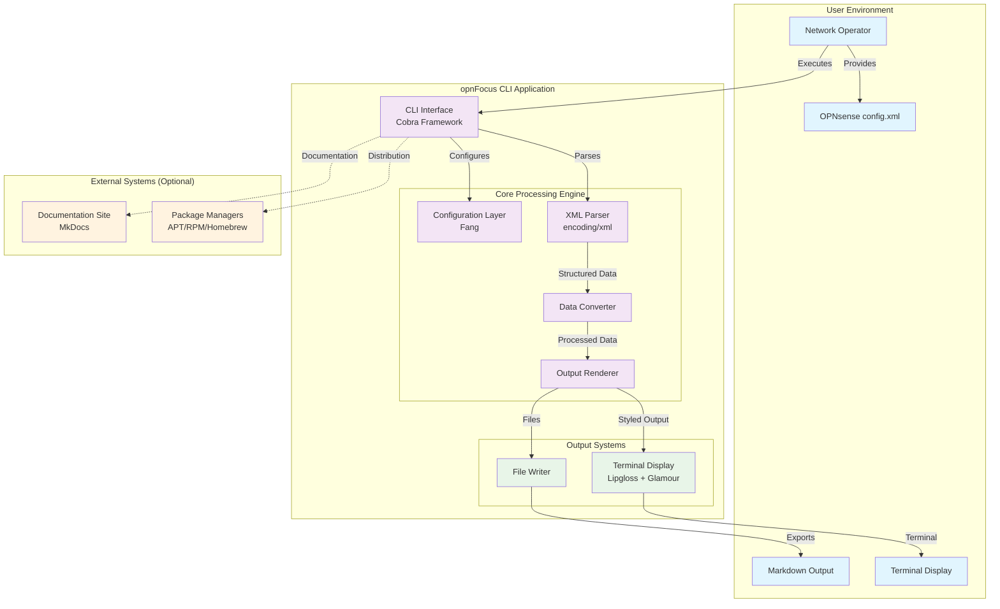
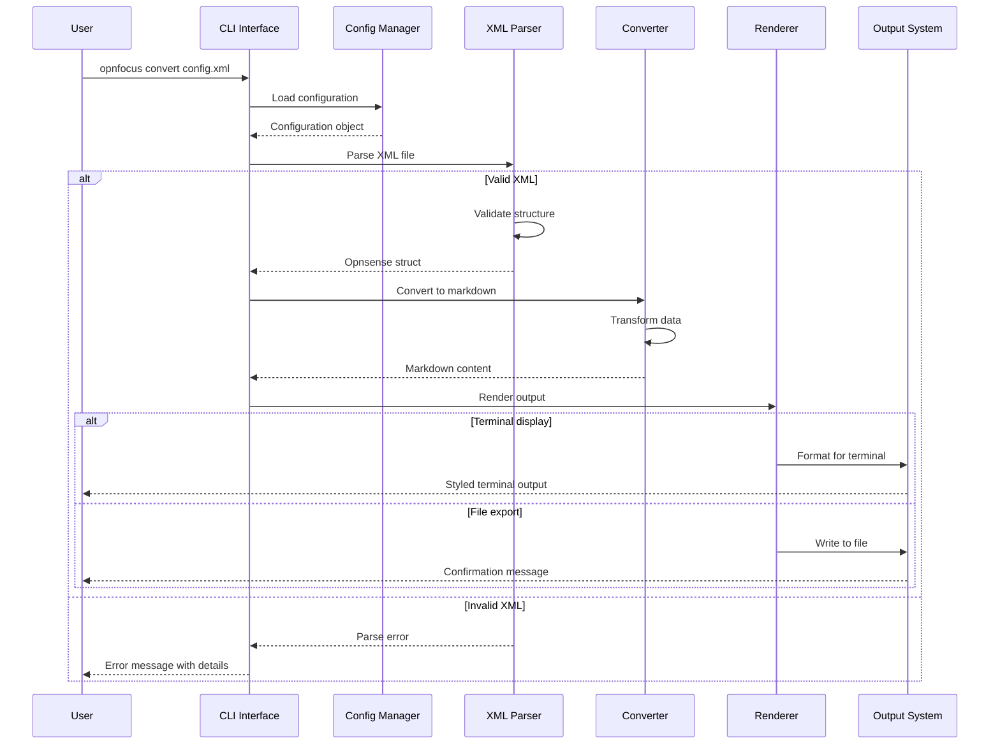
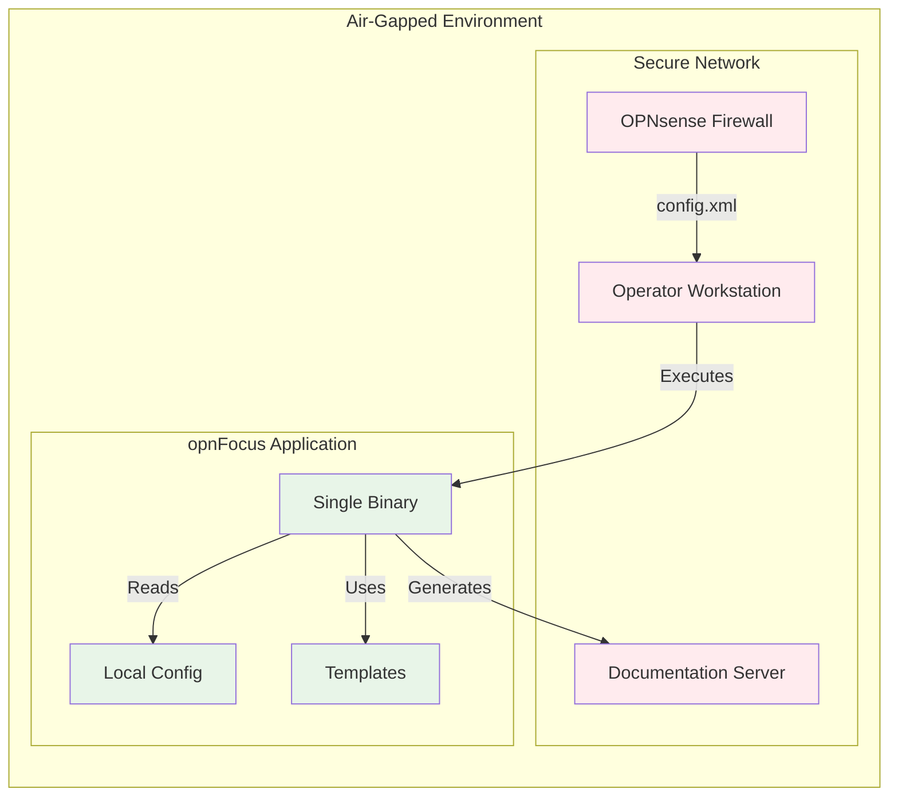
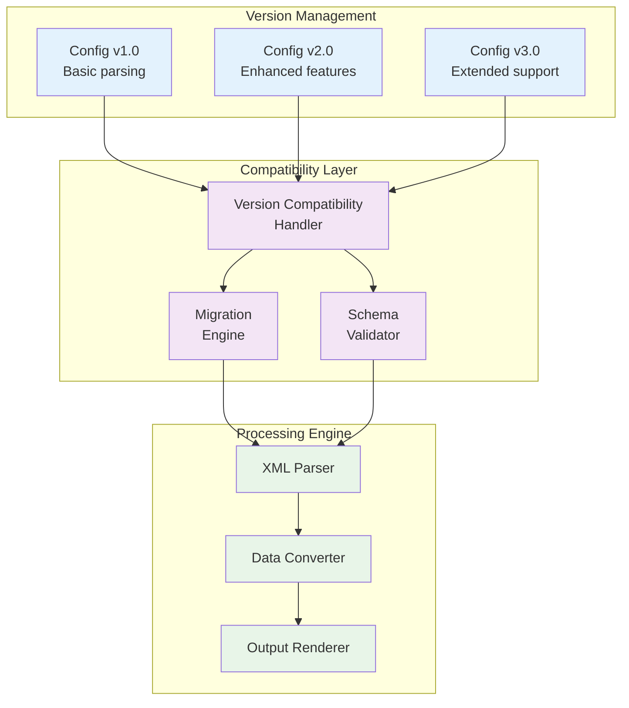
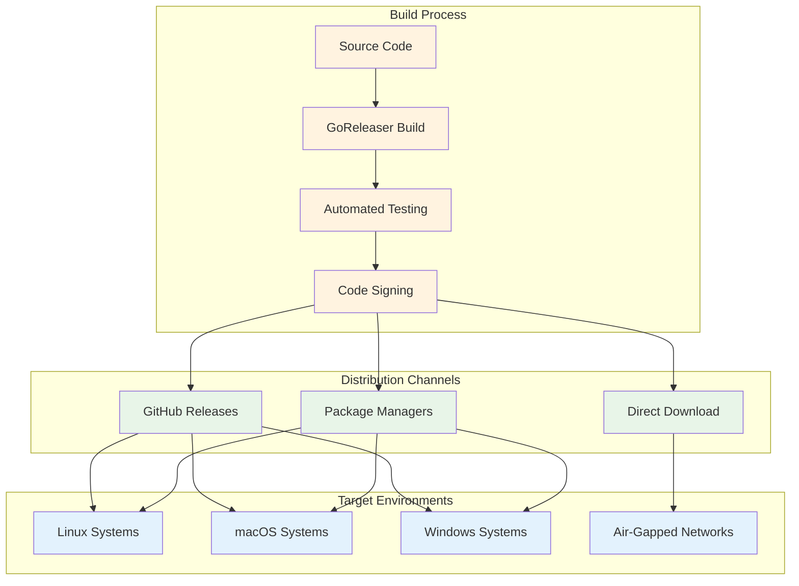
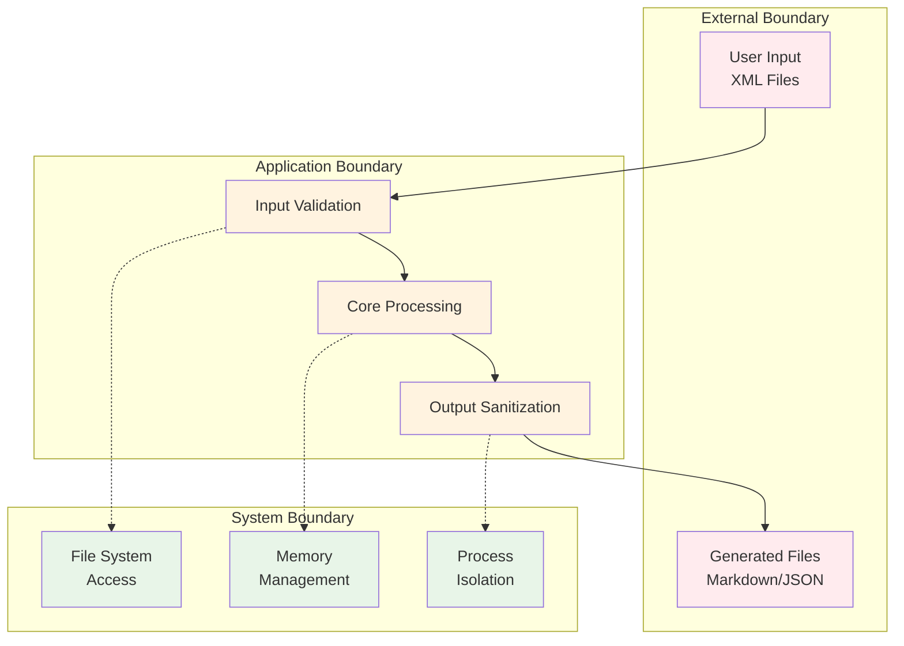

# System Architecture

This document provides a comprehensive overview of the opnFocus system architecture, including high-level design, data flow, storage patterns, and external integrations.

## Table of Contents

- [High-Level Architecture](#high-level-architecture)
- [System Components](#system-components)
- [Data Flow Architecture](#data-flow-architecture)
- [Storage Strategy](#storage-strategy)
- [External Integrations](#external-integrations)
- [Air-Gap/Offline Considerations](#air-gapoffline-considerations)
- [Versioned Data Strategy](#versioned-data-strategy)
- [Deployment Architecture](#deployment-architecture)
- [Security Architecture](#security-architecture)

## High-Level Architecture

opnFocus follows a **monolithic CLI architecture** with clear separation of concerns, designed for operator-centric workflows in offline environments.

### Architecture Principles

1. **Offline-First**: No external dependencies required for core functionality
2. **Operator-Focused**: Designed for network administrators and operators
3. **Framework-First**: Leverages established Go libraries and patterns
4. **Structured Data**: All processing maintains data structure and relationships
5. **Security-First**: No telemetry, no external network calls, input validation

## System Components

### CLI Interface Layer

**Technology**: Cobra CLI Framework

**Responsibilities**:

- Command-line argument parsing and validation
- User interaction and help system
- Command routing and execution
- Error handling and user feedback

**Key Components**:

- Root command handler (`cmd/root.go`)
- OPNsense processing command (`cmd/opnsense.go`)
- Configuration management integration

### Configuration Management Layer

**Technology**: spf13/viper

**Responsibilities**:

- Configuration file parsing (YAML)
- Environment variable processing
- Command-line flag integration
- Configuration precedence management

**Configuration Sources** (in order of precedence):

1. **Command-line flags** (highest priority)
2. **Environment variables** (`OPNFOCUS_*`)
3. **Configuration file** (`~/.opnFocus.yaml`)
4. **Default values** (lowest priority)

This follows the standard precedence order used by most CLI tools, where environment variables can override configuration file settings for deployment flexibility and security.

### Data Processing Engine

#### XML Parser Component

**Technology**: Go's built-in `encoding/xml`

**Responsibilities**:

- OPNsense XML configuration parsing
- Schema validation and error reporting
- Structured data extraction
- Malformed input handling

**Data Structures**:

- `Opnsense` struct with complete XML mapping
- Nested structures for system, interfaces, firewall rules
- JSON tags for alternative serialization

#### Data Converter Component

**Responsibilities**:

- XML-to-Markdown transformation
- Configuration hierarchy preservation
- Metadata injection (timestamps, versions)
- Template-based output generation

#### Output Renderer Component

**Responsibilities**:

- Markdown formatting and styling
- Template processing
- Output format selection
- Content structuring

### Output Systems

#### Terminal Display System

**Technologies**:

- Charm Lipgloss (terminal styling)
- Charm Glamour (markdown rendering)

**Responsibilities**:

- Syntax highlighting
- Color theme management
- Terminal compatibility
- Interactive display modes

#### File Export System

**Responsibilities**:

- File system operations
- Directory creation
- Permission handling
- Output validation

## Data Flow Architecture

### Data Transformation Pipeline

1. **Input Validation**

   - File existence verification
   - XML syntax validation
   - Permission checks

2. **Parsing Phase**

   - XML deserialization
   - Structure validation
   - Error context preservation

3. **Conversion Phase**

   - Data mapping and transformation
   - Hierarchy preservation
   - Metadata enrichment

4. **Rendering Phase**

   - Template application
   - Format-specific rendering
   - Output optimization

5. **Output Phase**

   - Terminal display or file writing
   - User feedback
   - Error handling

## Storage Strategy

### Local File System

**Configuration Storage**:

- Default location: `~/.opnFocus.yaml`
- Format: YAML
- Scope: User-specific preferences

**Input Files**:

- Format: XML (OPNsense config.xml)
- Location: User-specified paths
- Validation: Schema-based

**Output Files**:

- Format: Markdown
- Location: User-specified or current directory
- Naming: Configurable with defaults

### Memory Management

**Structured Data**:

- Go structs for type safety
- Efficient XML unmarshaling
- Garbage collection optimized

**Large File Handling**:

- Streaming XML parsing for large configurations
- Memory-efficient processing
- Progress indicators for long operations

## External Integrations

### Documentation System

**Technology**: MkDocs with Material theme

**Integration Points**:

- Static documentation generation
- Example usage and tutorials
- API reference documentation
- Development guides

**Deployment**:

- Local development server
- Static site generation
- No runtime dependencies

### Package Distribution

**Technologies**:

- GoReleaser for multi-platform builds
- GitHub Releases for distribution
- Package managers (APT, RPM, Homebrew)

**Supported Platforms**:

- Linux (amd64, arm64)
- macOS (amd64, arm64, universal binaries)
- Windows (amd64, arm64)

**Package Formats**:

- Binary releases (tar.gz, zip)
- System packages (deb, rpm, apk)
- Homebrew formula
- Arch Linux packages

### Development Integration

**CI/CD Pipeline**:

- GitHub Actions for automated testing
- Cross-platform build verification
- Security scanning
- Documentation deployment

**Development Tools**:

- Just task runner for development workflows
- Pre-commit hooks for code quality
- golangci-lint for static analysis
- GoReleaser for release automation

## Air-Gap/Offline Considerations

### Core Design Principles

1. **Zero External Dependencies**: The application functions completely offline
2. **No Outbound Network Calls**: No telemetry, updates, or external API calls
3. **Self-Contained**: All required libraries embedded in the binary
4. **Portable**: Single binary deployment with no installation requirements

### Offline Functionality

### Data Exchange Patterns

**Import Mechanisms**:

- Local file system access
- USB drive compatibility
- Network share mounting
- Secure file transfer protocols

**Export Formats**:

- Markdown files for documentation
- JSON for structured data exchange
- Plain text for simple viewing
- HTML for web-based viewing (planned)

### Security Considerations

**Input Validation**:

- XML schema validation
- Path traversal prevention
- File size limits
- Content sanitization

**Data Handling**:

- No sensitive data logging
- Secure memory management
- Temporary file cleanup
- Permission-based access control

## Versioned Data Strategy

### Configuration Versioning

### Data Structure Evolution

**Schema Management**:

- Backward compatibility for older OPNsense versions
- Forward compatibility for newer configurations
- Migration utilities for format changes
- Deprecation warnings for obsolete features

**Version Detection**:

- Automatic OPNsense version detection
- Schema validation based on version
- Feature availability mapping
- Compatibility warnings

**Output Versioning**:

- Markdown format versioning
- Template evolution management
- Metadata version tracking
- Change documentation

### Non-Destructive Updates

**Principles**:

- Original files never modified
- New versions create new outputs
- Rollback capabilities maintained
- Audit trail preservation

**Implementation**:

- Timestamped output files
- Version metadata in headers
- Change tracking in outputs
- Diff generation capabilities

## Deployment Architecture

### Single Binary Distribution

### Installation Patterns

**System Installation**:

- Package manager integration
- System-wide availability
- Automatic updates (where permitted)
- Dependency management

**Portable Installation**:

- Single binary execution
- No installation required
- USB drive compatibility
- Network share deployment

**Containerized Deployment**:

- Docker image availability (planned)
- Kubernetes compatibility (planned)
- Isolated execution environment
- Reproducible builds

## Security Architecture

### Security Boundaries

### Security Controls

**Input Security**:

- XML parser security (XXE prevention)
- Path traversal protection
- File size limitations
- Content validation

**Processing Security**:

- Memory safety (Go runtime)
- Type safety (static typing)
- Error handling (no panics)
- Resource limits

**Output Security**:

- Path validation
- Permission checks
- Content sanitization
- Secure file creation

### Threat Model

**Threats Addressed**:

- Malicious XML files
- Path traversal attacks
- Resource exhaustion
- Information disclosure

**Threats Not Addressed** (by design):

- Network-based attacks (offline operation)
- Multi-user environments (single-user tool)
- Privilege escalation (user-level operation)
- Data exfiltration (local processing only)

---

This architecture documentation provides a comprehensive overview of the opnFocus system design, emphasizing its offline-first, operator-focused approach while maintaining security and reliability for network infrastructure management tasks.
